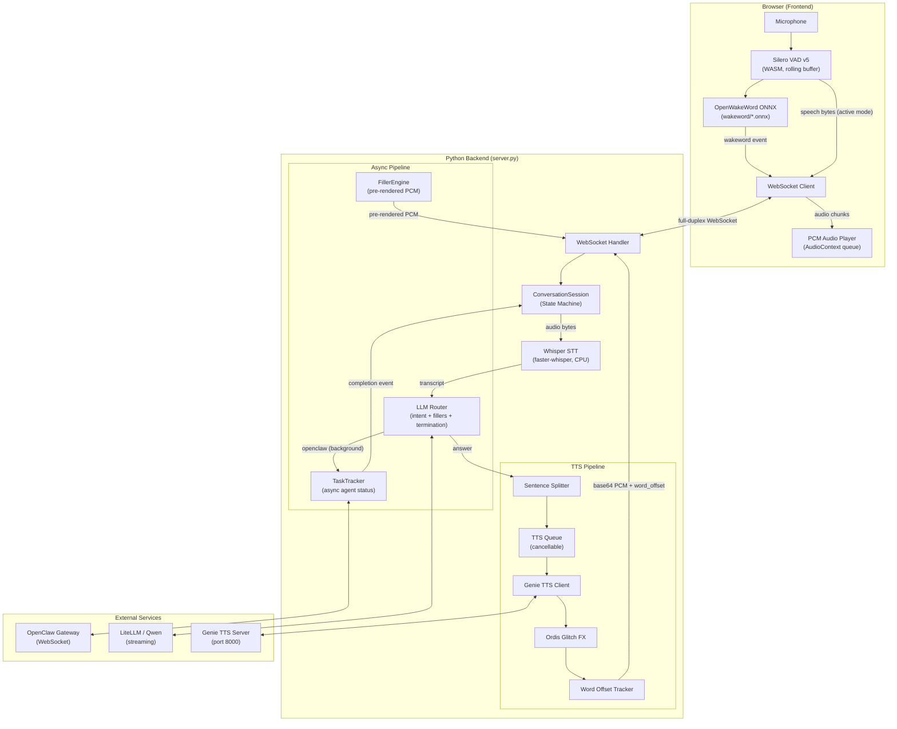
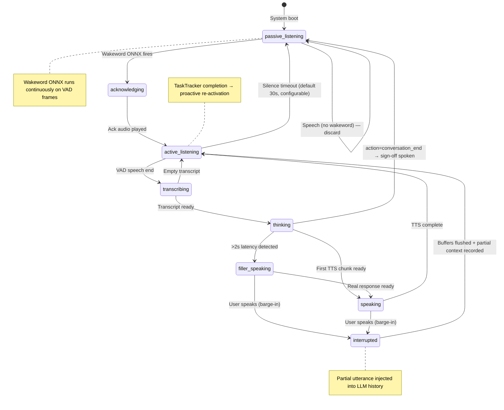

# Voice Satellite — Next-Gen Architecture Plan

> **Status**: Implementing

Redesign the voice satellite for seamless, low-latency conversational interaction with wakeword support, robust barge-in, async task tracking, intelligent fillers, and hardened VAD.

---

## Architecture Overview



---

## Conversation State Machine



---

## WebSocket Protocol (Updated)

### Client → Server

| Message | When | Payload |
|---------|------|---------|
| `binary` | VAD speech end (active mode) | Raw PCM bytes |
| `{"type":"wakeword"}` | Wakeword ONNX fires | — |
| `{"type":"interrupt"}` | User speaks mid-response | — |
| `{"type":"playback_progress","words_played":N,"chunks_played":M}` | Sent just before interrupt | Used to reconstruct partial context |
| `{"type":"set_timeout","seconds":30}` | UI slider change | Updates silence timeout |

### Server → Client

| Message | When | Payload |
|---------|------|---------|
| `{"type":"status","state":"..."}` | State transitions | State name |
| `{"type":"audio","data":"...","word_offset":N,"sample_rate":32000}` | TTS chunk | Base64 PCM + word tracking |
| `{"type":"flush_audio"}` | Barge-in initiated by backend | — |
| `{"type":"audio_end"}` | TTS complete | — |
| `{"type":"transcript","text":"..."}` | After Whisper | — |
| `{"type":"decision","action":"..."}` | Router decided | Action + metadata |
| `{"type":"task_complete","task_id":"...","summary":"..."}` | Background agent done | Task result summary |
| `{"type":"assistant_delta","text":"..."}` | LLM streaming | Text chunk |
| `{"type":"assistant_response","text":"..."}` | Turn complete | Full text |
| `{"type":"error","message":"..."}` | Pipeline failure | — |

---

## Component Breakdown

### 1. `voice_satellite/session.py` — NEW

Central `ConversationSession` state machine. One instance per WebSocket connection.

**Key interface:**
```python
class SessionState(Enum):
    PASSIVE_LISTENING = "passive_listening"
    ACKNOWLEDGING = "acknowledging"
    ACTIVE_LISTENING = "active_listening"
    TRANSCRIBING = "transcribing"
    THINKING = "thinking"
    FILLER_SPEAKING = "filler_speaking"
    SPEAKING = "speaking"
    INTERRUPTED = "interrupted"

class ConversationSession:
    state: SessionState
    generation_task: asyncio.Task | None   # main handle_audio task
    silence_timer: asyncio.Task | None     # returns to passive on expiry
    silence_timeout: float                 # default 30.0, UI-configurable

    # Barge-in context tracking
    current_response_words: list[str]      # words of current response
    words_played_before_interrupt: int     # reported by frontend

    async def transition(self, new_state: SessionState) -> None
    async def cancel_generation(self) -> str   # returns partial utterance heard
    async def start_silence_timer(self) -> None
    def reset_silence_timer(self) -> None
```

### 2. `voice_satellite/task_tracker.py` — NEW

Event-driven background OpenClaw task manager.

```python
@dataclass
class TrackedTask:
    task_id: str
    agent_id: str
    description: str
    status: Literal["running", "completed", "failed"]
    result: str | None
    started_at: float
    asyncio_task: asyncio.Task

class TaskTracker:
    """
    Manages background OpenClaw agent tasks.
    On completion, fires an on_complete callback so server.py can:
      - speak a notification if session is active
      - proactively wake the session if passive
    """
    async def spawn(
        self,
        agent_id: str,
        message: str,
        description: str,
        on_complete: Callable[[TrackedTask], Awaitable[None]],
    ) -> str  # returns task_id

    def get_summary(self) -> str     # "2 tasks running: ..."
    def get_task(self, task_id: str) -> TrackedTask | None
    def all_running(self) -> list[TrackedTask]
```

### 3. `voice_satellite/filler_engine.py` — NEW

Loads pre-rendered PCM files at startup and serves them instantly.

```python
class FillerEngine:
    fillers: dict[str, list[bytes]]  # category → [pcm, pcm, ...]

    def __init__(self, filler_dir: Path): ...
    def loaded(self) -> bool: ...
    def get_filler(self, category: str) -> bytes | None   # random choice
```

Categories loaded from `static/fillers/<category>/<name>.pcm`:
- `thinking/` — "Hmm.", "One moment.", "Let me think."
- `working/` — "Let me check the weave.", "Analyzing.", "Running diagnostics."
- `slow_task/` — "This might take a moment.", "Working on that now."
- `acknowledge/` — "Yes, Operator?", "Ordis is listening.", "Go ahead, Operator."
- `signoff/` — "I'll see you next time, Operator.", "Until next time, Operator."

### 4. `generate_fillers.py` — NEW

Batch-renders all filler phrases via the live Genie TTS server, saves as raw PCM.

```
python generate_fillers.py
```

Connects to `GENIE_TTS_URL` (default: `http://127.0.0.1:8000`), synthesizes each phrase, saves to `static/fillers/<category>/<slug>.pcm`.

### 5. `voice_satellite/llm_router.py` — MODIFY

Add new actions to `COORDINATOR_SYSTEM_PROMPT`:

- `check_tasks` — User asked about running tasks. Return a natural status message.
- `conversation_end` — User is signing off. Return a farewell message to speak.

Dynamic context injection: When `TaskTracker` has running tasks, their summaries are appended to the system prompt so the router can reference them.

### 6. `server.py` — MAJOR REFACTOR

- Replace flat `generation_task` with `ConversationSession`
- Handle `{"type":"wakeword"}` message → play ack filler → transition to active
- Handle `{"type":"playback_progress"}` → store in session for barge-in context
- Handle `{"type":"set_timeout"}` → update `session.silence_timeout`
- Wire `FillerEngine` into `handle_audio()` via 2s timer race
- Wire `TaskTracker` into `answer_with_qwen_session()`
- Smart termination: after each response, check if `action == "conversation_end"`
- Word offset tracking in `synthesize_sentence()`

### 7. `static/index.html` — MAJOR REFACTOR

- **OpenWakeWord ONNX**: Load `wakeword/*.onnx` via `ort.InferenceSession`. Run on every VAD frame. Send `{"type":"wakeword"}` when score exceeds threshold.
- **Playback word tracking**: Track word offsets as chunks are played. Report in `playback_progress` before interrupt.
- **VAD tuning**: Adjusted thresholds (preSpeechPadFrames: 38, positiveSpeechThreshold: 0.5, negativeSpeechThreshold: 0.25, redemptionFrames: 24, minSpeechFrames: 6).
- **Noise floor calibration**: Auto-calibrate RMS noise floor from first 2s of silence.
- **Settings UI**: Silence timeout slider (10–120s), persisted in `localStorage`.
- **Mode indicator**: Show "passive" vs "active" listening state clearly.
- **flush_audio handler**: Immediate audio stop on server-initiated flush.

---

## Design Decisions

| Decision | Choice | Rationale |
|----------|--------|-----------|
| Wakeword | OpenWakeWord ONNX (user-provided, `wakeword/`) in-browser | Zero backend round-trip, no Whisper for wakeword |
| Filler delivery | Pre-rendered PCM, loaded at startup | Zero synthesis latency — played from RAM |
| Filler trigger | 2s asyncio timer race | Empirically: responses >2s feel awkward without something |
| Silence timeout | 30s default, UI slider 10–120s | Persistent in localStorage |
| OpenClaw completion | Event-driven callback on asyncio.Task done | True event-push, no polling overhead |
| Passive wakeup | Proactive: play ack + notification, return to active | Natural — as if Ordis interrupts himself to tell you |
| Barge-in context | `words_played` reported by frontend | Accurate reconstruction of what user actually heard |
| Filler dir layout | `static/fillers/<category>/<name>.pcm` | Easy to add/replace phrases per-voice |

---

## File Manifest

| File | Status | Purpose |
|------|--------|---------|
| `voice_satellite/session.py` | NEW | Conversation state machine |
| `voice_satellite/task_tracker.py` | NEW | Async OpenClaw task management |
| `voice_satellite/filler_engine.py` | NEW | Pre-rendered filler audio loader |
| `voice_satellite/llm_router.py` | MODIFY | Add check_tasks + conversation_end actions |
| `server.py` | MAJOR REFACTOR | Wire everything together |
| `static/index.html` | MAJOR REFACTOR | Wakeword ONNX, VAD tuning, settings UI |
| `generate_fillers.py` | NEW | Batch filler synthesis script |
| `static/fillers/` | NEW | Pre-rendered PCM filler audio |
| `test_session.py` | NEW | State machine unit tests |
| `test_filler_engine.py` | NEW | Filler engine unit tests |
| `test_task_tracker.py` | NEW | Task tracker unit tests |

---

## Verification

```bash
# Server startup smoke test
./start_servers.sh
# Verify both servers start without errors
./stop_servers.sh

# Unit tests (manual, no pytest)
python test_session.py
python test_filler_engine.py
python test_task_tracker.py
python test_llm_router.py       # existing, must still pass
python test_openclaw_gateway.py # existing, must still pass
python test_genie_tts_client.py # existing, must still pass
```
