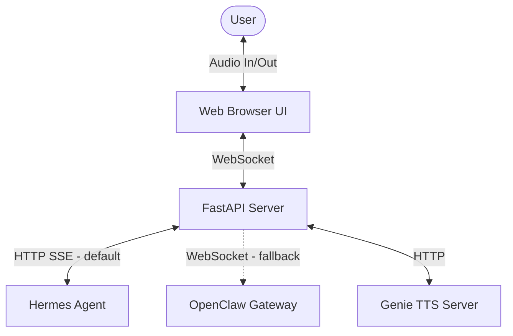

# Voice Satellite Core

A hardware-agnostic, low-latency client application for conversational assistant systems like OpenClaw and Nous Research's Hermes Agent. It runs locally on your PC, Raspberry Pi, or other hardware, providing high-performance Speech-to-Text (STT), Text-to-Speech (TTS), local Voice Activity Detection (VAD), and custom Wakeword detection.

## Key Features

- **Local Wakeword & VAD**: Uses lightweight ONNX models (via OpenWakeWord) and Silero VAD running directly in the browser/client to minimize network bandwidth.
- **Dynamic TTS Effects**: Real-time DSP audio effects pipeline supporting pitch-shifting, overdrive, tremolo, bit-crushing, and stuttering for custom character voice rendering (such as a glitchy synthesised voice).
- **Graceful Degraded Mode**: Automatically detects network/service dropouts and degrades gracefully to a text-only interface, retrying connection on the next user turn.
- **Barge-in Support**: Interrupt the assistant mid-response by speaking or pressing the interrupt trigger.
- **Low-Latency Streaming**: Supports low-latency streaming backends using OpenAI-compatible HTTP SSE (Hermes Agent) or bidirectional WebSocket protocols (OpenClaw Gateway).

## Architecture

The Voice Satellite Core acts as the local interface layer, orchestrating audio devices, local ML processing, and the remote backend gateway. It supports both the new **Hermes Agent** backend and the legacy **OpenClaw** gateway as swappable clients.

For a detailed design of the system components and state machine, refer to the [System Architecture Spec](specs/001-voice-satellite-core/spec.md) and the [Implementation Plan](specs/001-voice-satellite-core/plan.md). For the Hermes integration, refer to the [Hermes Gateway Spec](specs/002-hermes-gateway/spec.md) and [Plan](specs/002-hermes-gateway/plan.md).

## Quickstart

Get the Voice Satellite running in under 10 minutes:
- For the default **Hermes Agent** backend: follow the [Hermes Quickstart Guide](specs/002-hermes-gateway/quickstart.md).
- For the legacy **OpenClaw** gateway backend: follow the [OpenClaw Quickstart Guide](specs/001-voice-satellite-core/quickstart.md).

## Configuration

Configuration is managed via environment variables. Copy `.env.example` to `.env` and fill in the required variables.

### Backend Selection
By default, the Voice Satellite utilizes the Hermes backend. You can toggle between backends using the `GATEWAY_BACKEND` variable:
- `GATEWAY_BACKEND`: Selects the gateway backend. Options: `hermes` (default) or `openclaw`.

### Hermes Gateway Configuration
When `GATEWAY_BACKEND=hermes` is active:
- `HERMES_BASE_URL`: Base URL of the OpenAI-compatible HTTP SSE API of your Hermes Agent (default: `http://localhost:8642/v1`).

### OpenClaw Gateway Configuration
When `GATEWAY_BACKEND=openclaw` is active:
- `OPENCLAW_GATEWAY_URL`: Base HTTP/WebSocket URL of the OpenClaw gateway (default: `http://127.0.0.1:18789`).
- `OPENCLAW_GATEWAY_TOKEN`: Required access token for the OpenClaw Gateway.
- `OPENCLAW_AGENT_ID`: Target agent ID to route voice interactions (default: `main`).

### Genie TTS Configuration
- `GENIE_TTS_URL`: Address of the Genie TTS server (default: `http://127.0.0.1:8000`).

For a full list of settings and options, check the [Hermes Quickstart Guide](specs/002-hermes-gateway/quickstart.md) or the [OpenClaw Quickstart Guide Configuration section](specs/001-voice-satellite-core/quickstart.md#2-configure).

## Contribution Guidelines

Contributions are welcome! Please ensure that any changes align with our core design principles and project standards. For detailed guidelines, refer to the [Project Constitution](specs/001-voice-satellite-core/constitution.md).
