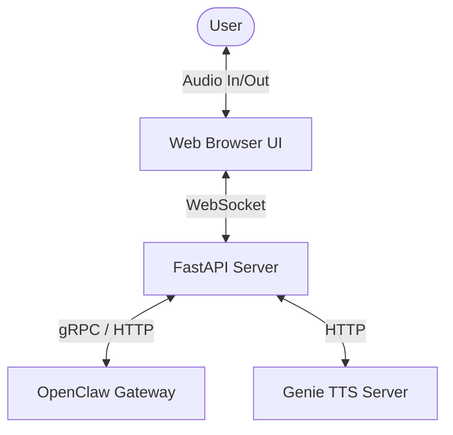

# Voice Satellite Core

A hardware-agnostic, low-latency client application for the OpenClaw conversational assistant system. It runs locally on your PC, Raspberry Pi, or other hardware, providing high-performance Speech-to-Text (STT), Text-to-Speech (TTS), local Voice Activity Detection (VAD), and custom Wakeword detection.

## Key Features

- **Local Wakeword & VAD**: Uses lightweight ONNX models (via OpenWakeWord) and Silero VAD running directly in the browser/client to minimize network bandwidth.
- **Dynamic TTS Effects**: Real-time DSP audio effects pipeline supporting pitch-shifting, overdrive, tremolo, bit-crushing, and stuttering for custom character voice rendering (such as Ordis' glitchy synthesised voice).
- **Graceful Degraded Mode**: Automatically detects network/service dropouts and degrades gracefully to a text-only interface, retrying connection on the next user turn.
- **Barge-in Support**: Interrupt the assistant mid-response by speaking or pressing the interrupt trigger.
- **Low-Latency Streaming**: Bidirectional speech and state streaming over WebSockets.

## Architecture

The Voice Satellite Core acts as the local interface layer, orchestrating audio devices, local ML processing, and the remote OpenClaw Gateway.

For a detailed design of the system components and state machine, refer to the [System Architecture Spec](specs/001-voice-satellite-core/spec.md) and the [Implementation Plan](specs/001-voice-satellite-core/plan.md).

## Quickstart

Get the Voice Satellite running in under 10 minutes by following the [Quickstart Guide](specs/001-voice-satellite-core/quickstart.md).

## Configuration

Configuration is managed via environment variables. Copy `.env.example` to `.env` and fill in the required variables.

Key configuration options include:
- `LITELLM_API_KEY`: API key for router model.
- `OPENCLAW_GATEWAY_TOKEN`: Access token for the OpenClaw Gateway.
- `GENIE_TTS_URL`: Address of the Genie TTS server.

See [Quickstart Guide Configuration section](specs/001-voice-satellite-core/quickstart.md#2-configure) for more details.

## Contribution Guidelines

Contributions are welcome! Please ensure that any changes align with our core design principles and project standards. For detailed guidelines, refer to the [Project Constitution](specs/001-voice-satellite-core/constitution.md).
