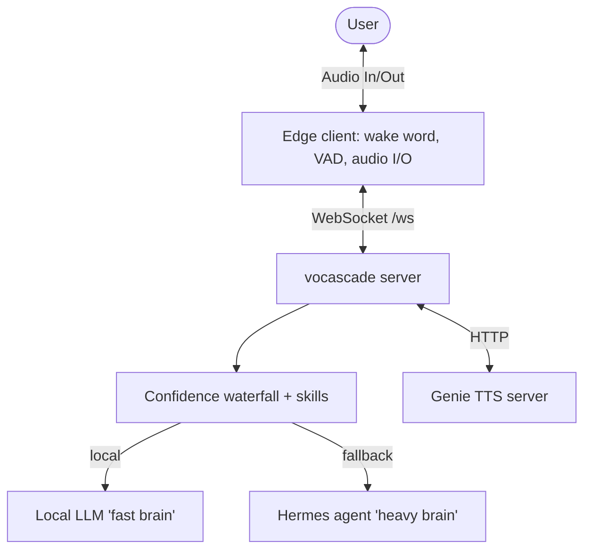

# vocascade

A self-hosted voice assistant you point at **your own LLM**. Talk to it out
loud, and it talks back in a cloned voice. It runs wake-word detection and
transcription on your own machine, answers chit-chat and simple commands
instantly, and can optionally hand anything that needs real data or actions to
a **Hermes agent** — speaking the answer the moment it comes back.

No cloud STT/TTS, no third-party voice framework in the path.

## What you need

- **Python 3.11** and the project virtualenv (`.venv`).
- An OpenAI-compatible **LLM** endpoint (`LLM_BASE_URL` + `LLM_MODEL`) — the
  "fast brain" for smalltalk and intent routing. Bring your own: a local server
  (Ollama, llama.cpp-server, vLLM, LiteLLM, …) or a cloud key (OpenRouter,
  Gemini's OpenAI-compatible endpoint, …). Same config either way — it's just a
  base URL, an optional key, and a model name. **Required** — the server won't
  start without it.
- A **microphone** (to run the edge client) or just a **browser**.
- *(Optional)* A **Hermes agent** endpoint (`HERMES_BASE_URL`) — the "heavy
  brain" for real data and external actions. Leave it unset to run local-only.
- **A voice is included**: the default TTS backend is **Piper** — in-process,
  CPU-only, zero setup. The stock voice (~60 MB) downloads automatically on
  first start (set `TTS_VOICE=male` for the male voice). *(Optional)*
  **Genie TTS** (`TTS_BACKEND=genie`) swaps in a custom cloned voice. If the
  selected backend can't load, vocascade still runs and replies as text —
  voice degrades gracefully, it doesn't break.

## Setup (one-time)

```bash
python3.11 -m venv .venv
.venv/bin/pip install -r requirements.txt

# Optional: only for the custom-voice (genie) backend — set up voice-cloning
# TTS in its own venv. The default piper voice needs nothing here.
bash scripts/setup_genie.sh
```

> **Upgrading from a Genie-voice install?** The default TTS backend is now
> `piper`. Add `TTS_BACKEND=genie` to your `.env` to keep your cloned voice.

## Configure

The easy way — a localhost web GUI that writes your config files for you:

```bash
.venv/bin/python -m vocascade.setup_server     # -> http://127.0.0.1:8099
```

Use the **Test connection** button on the LLM fields to verify your endpoint
and key before saving.

Or by hand — copy the templates and set the endpoint that matters
(`LLM_BASE_URL` + `LLM_MODEL`; `HERMES_BASE_URL` is optional):

```bash
cp .env.example .env                 # secrets + endpoints
cp config.yaml.example config.yaml   # waterfall, skills, latency
```

Missing or malformed required values fail fast at startup with a located
message. On startup the health report probes your endpoints and prints a
verdict (OK / auth rejected / unreachable) — and if the assistant can't reach
its language model mid-session, it says so out loud instead of failing
silently.

## Run

With the default piper voice, the server alone is the whole stack:

```bash
.venv/bin/python -m vocascade
```

With the genie backend, one command brings up Genie TTS, then the vocascade
server (Ctrl-C stops both):

```bash
bash scripts/run_voice_stack.sh
```

Then connect a client:

```bash
.venv/bin/python -m vocascade.edge   # mic + wake word on this machine
# …or open static/index.html in a browser and talk from there
```

Say the wake word, then your request. (Your Hermes agent and local LLM are
*remote endpoints* you point at — they aren't started by this stack.)

## How it works

Each utterance flows through an ordered **confidence waterfall** — the first
stage to clear its threshold wins:

```
STOP → CONVERSE → HIGH (keywords) → MEDIUM (local-LLM classifier) → SMALLTALK → HERMES
```

- **STOP / CONVERSE** — hard stop/farewell, and multi-turn follow-up capture.
- **HIGH** — fast deterministic keyword skills (datetime, timers).
- **MEDIUM** — a local-LLM intent classifier, its prompt auto-generated from each
  skill's example phrases.
- **SMALLTALK** — the local LLM answers chit-chat in persona, and *abstains* for
  anything needing real data so it falls through to…
- **HERMES** — the always-async agent. It dispatches a run, streams the reply
  into TTS sentence-by-sentence, and delivers late results proactively. With no
  `HERMES_BASE_URL` configured this stage is dropped (local-only mode) and the
  assistant says it can't help with requests nothing else handled.



## Add a skill

Drop a file in `user_skills/` with an `@skill` decorator and a `config.yaml`
entry — no changes to the pipeline, STT, or TTS. See `user_skills/alarm.py` for a
worked example.

## More

- Architecture, commands, and gotchas for contributors: [`AGENTS.md`](AGENTS.md).
- Full walkthrough: [`docs/legacy-specs/006-custom-voice-pipeline-waterfall/quickstart.md`](docs/legacy-specs/006-custom-voice-pipeline-waterfall/quickstart.md).
