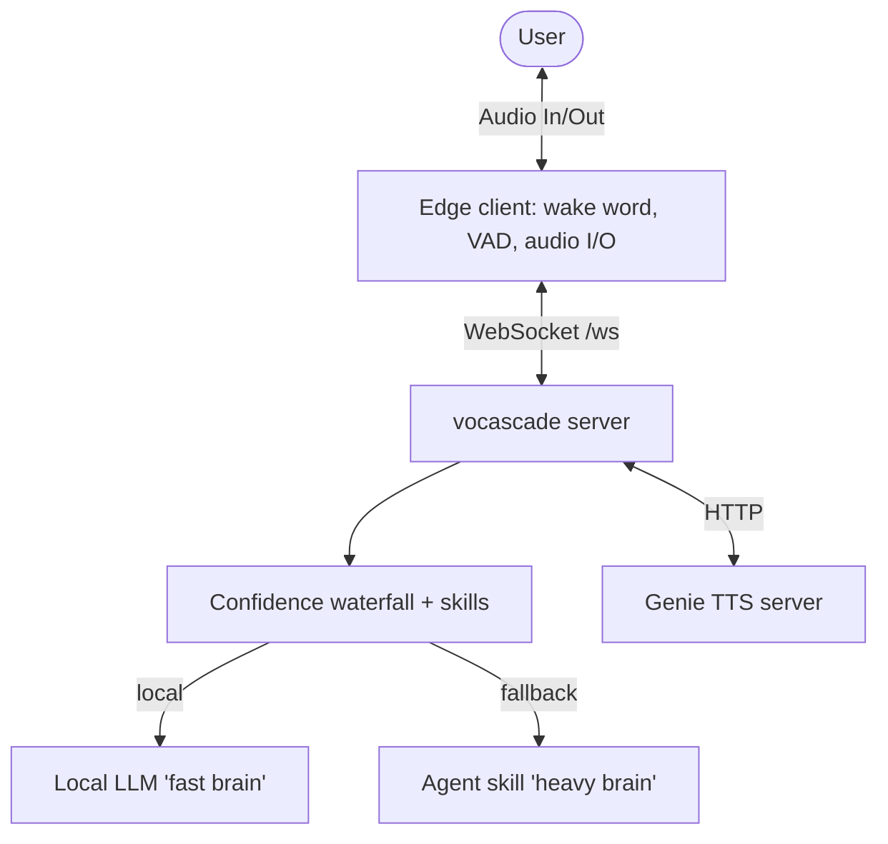

# vocascade

A self-hosted voice assistant you point at **your own LLM**. Talk to it out
loud, and it talks back. It runs wake-word detection, transcription, and
speech on your own machines, answers chit-chat and simple commands instantly,
and can optionally hand anything that needs real data or actions to a
**Hermes agent** — speaking the answer the moment it comes back.

No cloud STT/TTS, no third-party voice framework in the path.

## Beta status — read before installing

vocascade is in **beta**. What that means today, honestly:

- **One satellite at a time.** The host serves a single voice session; a
  second concurrent connection is rejected (WebSocket close 1008).
  Multi-satellite is the headline for v1.1.
- **Linux only** for the edge client (PipeWire / PulseAudio / ALSA). The host
  runs anywhere Docker runs.
- **English only** — STT, the waterfall, and the stock voices.

## What you need

- **Linux** with **Python 3.11+** (edge client), or **Docker** (host).
- An OpenAI-compatible **LLM** endpoint (`LLM_BASE_URL` + `LLM_MODEL`) — the
  "fast brain" for smalltalk and intent routing. Bring your own: a local server
  (Ollama, llama.cpp-server, vLLM, LiteLLM, …) or a cloud key (OpenRouter,
  Gemini's OpenAI-compatible endpoint, …). Same config either way — it's just a
  base URL, an optional key, and a model name. **Required** — the server won't
  start without it.
- A **microphone** (to run the edge client) or just a **browser**.
- *(Optional)* A **Hermes agent** endpoint (`HERMES_BASE_URL`) — the "heavy
  brain" for real data and external actions. Leave it unset to run local-only.
- **A voice and a wake word are included**: the default TTS backend is
  **Piper** — in-process, CPU-only, zero setup; the stock voice (~60 MB)
  downloads automatically on first start (set `TTS_VOICE=male` for the male
  voice). The default wake word is **"hey Jarvis"** (bundled with
  openwakeword; point `WAKE_WORD_MODEL` at any custom `.onnx` to change it).
  *(Optional)* **Genie TTS** (`TTS_BACKEND=genie`) swaps in a custom cloned
  voice. If the selected backend can't load, vocascade still runs and replies
  as text — voice degrades gracefully, it doesn't break.

## Quickstart — one Linux box

Both roles (host server + edge client) on one machine over localhost.

```bash
# OS prerequisite for the mic (pyaudio builds against portaudio):
#   Debian/Ubuntu: sudo apt install portaudio19-dev python3-dev
#   Fedora:        sudo dnf install portaudio-devel python3-devel
#   Arch:          sudo pacman -S portaudio

git clone https://github.com/aiden-isaac/vocascade && cd vocascade
python3 -m venv .venv
.venv/bin/pip install -e ".[edge]"

# Optional: only for the custom-voice (genie) backend — set up voice-cloning
# TTS in its own venv. The default piper voice needs nothing here.
bash scripts/setup_genie.sh
```

> **Upgrading from a Genie-voice install?** The default TTS backend is now
> `piper`. Add `TTS_BACKEND=genie` to your `.env` to keep your cloned voice.
> Installs that predate the packaging change can delete their old
> `pip install -r requirements.txt` venv and reinstall as above.

## Configure

The easy way — a localhost web GUI that writes your config files for you:

```bash
.venv/bin/python -m vocascade.setup_server     # -> http://127.0.0.1:8099
```

Use the **Test connection** button on the LLM fields to verify your endpoint
and key before saving.

Or by hand — copy the templates and set the endpoint that matters
(`LLM_BASE_URL` + `LLM_MODEL`; `HERMES_BASE_URL` is optional):

```bash
cp .env.example .env                 # secrets + endpoints
cp config.yaml.example config.yaml   # waterfall, skills, latency
```

Missing or malformed required values fail fast at startup with a located
message. On startup the health report probes your endpoints and prints a
verdict (OK / auth rejected / unreachable) — and if the assistant can't reach
its language model mid-session, it says so out loud instead of failing
silently.

## Run

With the default piper voice, the server alone is the whole stack:

```bash
.venv/bin/vocascade
```

With the genie backend, one command brings up Genie TTS, then the vocascade
server (Ctrl-C stops both):

```bash
bash scripts/run_voice_stack.sh
```

Then connect a client:

```bash
.venv/bin/vocascade-edge             # mic + wake word on this machine
# …or open static/index.html in a browser and talk from there
```

Say **"hey Jarvis"**, then your request. (Your Hermes agent and local LLM are
*remote endpoints* you point at — they aren't started by this stack.)

## Split topology — Docker host + native edge

The recommended way to run the host on a server/homelab box: the host touches
no audio hardware, so it lives cleanly in a container. On the host machine:

```bash
git clone https://github.com/aiden-isaac/vocascade && cd vocascade
cp .env.example .env && cp config.yaml.example config.yaml   # then edit .env
docker compose up -d
```

Models and state (piper voice, whisper cache, task journal) persist in the
`vocascade-data` volume — recreating the container does not re-download them.
If your LLM runs on the same machine as the container, point at it with
`LLM_BASE_URL=http://host.docker.internal:11434/v1` (the compose file maps
`host.docker.internal` to the host).

On the satellite machine (the one with the mic and speaker) the edge client
runs **natively** — containerized audio passthrough is a support nightmare,
so it isn't offered:

```bash
python3 -m venv ~/.vocascade-edge && ~/.vocascade-edge/bin/pip install \
  "vocascade[edge] @ git+https://github.com/aiden-isaac/vocascade"
WS_URL=ws://your-host:8005/ws ~/.vocascade-edge/bin/vocascade-edge
```

To keep it running as a service, install the shipped systemd **user** unit
(user, not system — it needs your login session's PipeWire/PulseAudio):

```bash
mkdir -p ~/.config/systemd/user ~/.vocascade
cp deploy/vocascade-edge.service ~/.config/systemd/user/
echo "WS_URL=ws://your-host:8005/ws" > ~/.vocascade/edge.env
systemctl --user daemon-reload
systemctl --user enable --now vocascade-edge
loginctl enable-linger "$USER"       # survive logout
```

Building a satellite of your own (Android, ESP32, …)? The edge↔host wire
contract is a documented, versioned public interface: see
[`docs/protocol.md`](docs/protocol.md).

## How it works

Each utterance flows through an ordered **confidence waterfall** — the first
stage to clear its threshold wins:

```
STOP → CONVERSE → HIGH (keywords) → MEDIUM (local-LLM classifier) → SMALLTALK → AGENT
```

- **STOP / CONVERSE** — hard stop/farewell, and multi-turn follow-up capture.
- **HIGH** — fast deterministic keyword skills (datetime, timers).
- **MEDIUM** — a local-LLM intent classifier, its prompt auto-generated from each
  skill's example phrases.
- **SMALLTALK** — the local LLM answers chit-chat in persona, and *abstains* for
  anything needing real data so it falls through to…
- **AGENT** — the always-async last resort: whatever skill claims the role via
  `waterfall.agent_skill` (default: the bundled Hermes reference skill). It
  dispatches a background run, streams the reply into TTS sentence-by-sentence,
  and delivers late results proactively. When the claimed skill isn't usable
  (e.g. no `HERMES_BASE_URL` configured) the stage is dropped (local-only mode)
  and the assistant says it can't help with requests nothing else handled.



## Add a skill

Drop a file in `user_skills/` with an `@skill` decorator and a `config.yaml`
entry — no changes to the pipeline, STT, or TTS. See `user_skills/alarm.py` for a
worked example.

## Bring your own agent

The waterfall's last stage is generic: any skill can be the "heavy brain".
[`vocascade/skills/base_skills/hermes.py`](vocascade/skills/base_skills/hermes.py)
is the working reference — copy it to `user_skills/my_agent.py`, swap the
backend calls, and claim the role in `config.yaml`:

```yaml
waterfall:
  stages: [stop, converse, high, medium, smalltalk, agent]
  agent_skill: my_agent
```

The skill SDK gives an agent skill everything the bundled one uses:

- **Streaming**: make the handler an async generator — each yielded string is
  spoken as it arrives.
- **Async dispatch**: `ctx.task_broker` runs long work in the background
  (`None` when no backend is configured — degrade gracefully).
- **Proactive delivery**: `ctx.notify("…")` queues speech for the next idle
  moment, so late results never talk over the user.
- **Availability**: `@skill(name="my_agent", available=lambda: ...)` — return
  falsy and the agent stage isn't built, keeping the local-only fallback
  behavior instead of a broken agent.

## More

- Architecture, commands, and gotchas for contributors: [`AGENTS.md`](AGENTS.md).
- The edge↔host WebSocket contract: [`docs/protocol.md`](docs/protocol.md).
- Full walkthrough: [`docs/legacy-specs/006-custom-voice-pipeline-waterfall/quickstart.md`](docs/legacy-specs/006-custom-voice-pipeline-waterfall/quickstart.md).

## License

[AGPL-3.0](LICENSE).
