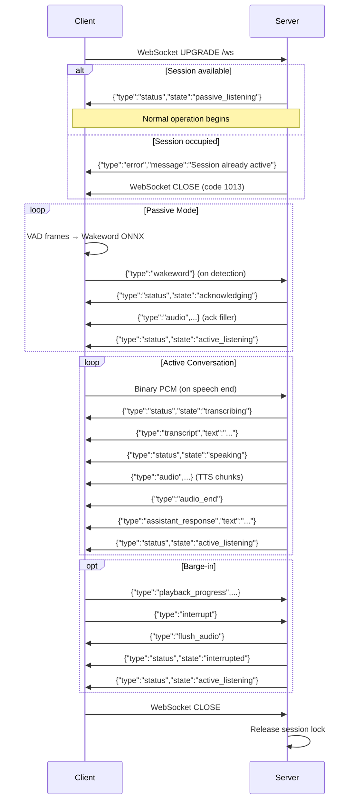

# WebSocket Protocol Contract
**Feature**: `001-voice-satellite-core` | **Version**: 1.0 | **Date**: 2026-05-19
## Overview
The Voice Satellite uses a single full-duplex WebSocket connection between the
browser frontend (client) and the Python backend (server). All messages except
raw audio are JSON. Raw audio is sent as binary WebSocket frames.
**Endpoint**: `ws://{host}:{port}/ws`
**Session policy**: Single active session. Additional connections receive an
error and are immediately closed (code 1013).
---
## Client → Server Messages
### Binary: Audio Data
| Property | Value |
|----------|-------|
| Format | Raw PCM: 16-bit signed, little-endian, mono |
| Sample Rate | 16,000 Hz |
| When | VAD detects speech end in active mode |
| Payload | `ArrayBuffer` of PCM bytes |
### JSON: Wakeword Detection
```json
{
  "type": "wakeword"
}
```
**When**: Wakeword ONNX classifier score exceeds threshold in passive mode.
### JSON: Interrupt (Barge-in)
```json
{
  "type": "interrupt"
}
```
**When**: User begins speaking while assistant audio is playing.
**Precondition**: MUST be preceded by a `playback_progress` message.
### JSON: Playback Progress
```json
{
  "type": "playback_progress",
  "words_played": 42,
  "chunks_played": 7
}
```
**When**: Sent immediately before an `interrupt` message.
**Fields**:
- `words_played` (int): Word offset of the last word actually heard by the user.
- `chunks_played` (int): Number of audio chunks fully played (informational).
### JSON: Set Timeout
```json
{
  "type": "set_timeout",
  "seconds": 30
}
```
**When**: User adjusts silence timeout slider in the UI.
**Fields**:
- `seconds` (int): New silence timeout value, range [10, 120].
---
## Server → Client Messages
### Status Update
```json
{
  "type": "status",
  "state": "active_listening"
}
```
**When**: Every state transition in the conversation state machine.
**Values**: `passive_listening`, `acknowledging`, `active_listening`,
`transcribing`, `thinking`, `filler_speaking`, `speaking`, `interrupted`
### Audio Chunk
```json
{
  "type": "audio",
  "data": "<base64-encoded PCM>",
  "word_offset": 0,
  "sample_rate": 32000
}
```
**When**: TTS audio chunk ready for playback (or filler audio).
**Fields**:
- `data` (string): Base64-encoded raw PCM (16-bit signed LE mono).
- `word_offset` (int): Cumulative word count at this chunk's start position.
- `sample_rate` (int): Audio sample rate (always 32000 for TTS output).
### Flush Audio
```json
{
  "type": "flush_audio"
}
```
**When**: Server initiates barge-in (stops all queued audio on the client).
### Audio End
```json
{
  "type": "audio_end"
}
```
**When**: All TTS chunks for the current response have been sent.
### Transcript
```json
{
  "type": "transcript",
  "text": "What's the server status?"
}
```
**When**: Whisper STT transcription is complete.

### Assistant Response (Complete)
```json
{
  "type": "assistant_response",
  "text": "The server is running normally, Operator."
}
```
**When**: Full assistant response text is available (after all TTS chunks sent).
### Assistant Delta (Streaming)
```json
{
  "type": "assistant_delta",
  "text": "The server"
}
```
**When**: LLM is streaming text tokens.

### Error
```json
{
  "type": "error",
  "message": "Session already active. Please wait."
}
```
**When**: Any pipeline failure or connection rejection.
---
## Connection Lifecycle

---
## Error Handling
- Unknown `type` values from the client MUST be silently ignored (logged at
  DEBUG level).
- Malformed JSON from the client MUST be logged as WARNING and ignored (no
  disconnect).
- Server errors during pipeline execution MUST be sent as
  `{"type": "error", "message": "..."}` and the session MUST return to
  `active_listening` (not crash).
- Binary frames received while in `passive_listening` state MUST be silently
  discarded.