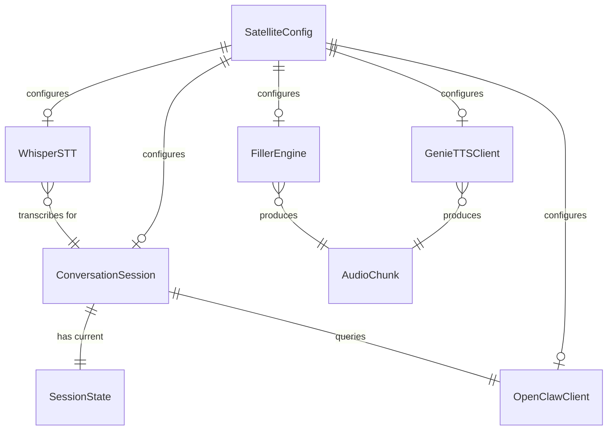

# Data Model: Voice Satellite Core Client
**Feature**: `001-voice-satellite-core` | **Date**: 2026-05-19
## Entities
### SatelliteConfig
Frozen dataclass loaded once at startup from `.env`. Consumed by all modules.
| Field | Type | Source | Required | Default |
|-------|------|--------|----------|---------|

| gateway_url | str | `OPENCLAW_GATEWAY_URL` | — | `http://127.0.0.1:18789` |
| gateway_token | str | `OPENCLAW_GATEWAY_TOKEN` | ✅ | — |
| gateway_agent_id | str | `OPENCLAW_AGENT_ID` | — | `main` |
| gateway_min_protocol | int | `GATEWAY_MIN_PROTOCOL` | — | `3` |
| gateway_max_protocol | int | `GATEWAY_MAX_PROTOCOL` | — | `4` |
| tts_url | str | `GENIE_TTS_URL` | — | `http://127.0.0.1:8000` |
| tts_character_name | str | `GENIE_CHARACTER_NAME` | — | `ordis` |
| tts_onnx_model_dir | str | `GENIE_ONNX_MODEL_DIR` | ⚠️ | — |
| tts_reference_audio | str | `GENIE_REFERENCE_AUDIO` | ⚠️ | — |
| tts_reference_text | str | `GENIE_REFERENCE_TEXT` | ⚠️ | — |
| tts_language | str | `GENIE_LANGUAGE` | — | `en` |
| whisper_model | str | `WHISPER_MODEL` | — | `tiny.en` |
| whisper_language | str | `WHISPER_LANGUAGE` | — | `en` |
| filler_dir | Path | `FILLER_DIR` | — | `static/fillers` |
| filler_threshold_secs | float | `FILLER_THRESHOLD_SECS` | — | `2.0` |
| host | str | `HOST` | — | `0.0.0.0` |
| port | int | `PORT` | — | `8000` |
| skip_genie_init | bool | `VOICE_SATELLITE_SKIP_GENIE_INIT` | — | `False` |
✅ = fail-fast if missing  | ⚠️ = warn + degraded TTS mode if missing
---
### SessionState (Enum)
States of the conversation state machine. One instance per active WebSocket
connection.
| Value | Description | Transitions To |
|-------|-------------|---------------|
| `passive_listening` | Monitoring wakeword only | `acknowledging` |
| `acknowledging` | Playing ack filler | `active_listening` |
| `active_listening` | Full VAD speech capture | `transcribing`, `passive_listening` |
| `transcribing` | Whisper STT in progress | `thinking`, `active_listening` |
| `thinking` | Awaiting OpenClaw response | `speaking`, `filler_speaking` |
| `filler_speaking` | Playing latency filler | `speaking`, `interrupted` |
| `speaking` | Playing TTS audio | `active_listening`, `interrupted` |
| `interrupted` | Barge-in — flushing buffers | `active_listening` |
---
### ConversationSession
Per-connection state machine instance.
| Field | Type | Description |
|-------|------|-------------|
| state | SessionState | Current state |
| generation_task | asyncio.Task \| None | Active audio generation pipeline |
| silence_timer | asyncio.Task \| None | Returns to passive on expiry |
| silence_timeout | float | Configurable 10–120 s, default 30 |
| current_response_words | list[str] | Full word list of current response |
| words_played_before_interrupt | int | Reported by frontend on barge-in |
---

---
### AudioChunk (Conceptual)
Not a persisted entity — represents the data flowing between pipeline stages.
| Field | Type | Description |
|-------|------|-------------|
| pcm_data | bytes | Raw PCM audio (16-bit signed LE mono) |
| sample_rate | int | 16000 (capture) or 32000 (TTS) |
| word_offset | int \| None | Cumulative word count at this chunk's start |
| tagged | bool | Whether this chunk has effect tags applied |
---
### WakewordModel (Frontend)
Configuration from `static/wakeword/model.json`.
| Field | Type | Description |
|-------|------|-------------|
| file | str | Classifier ONNX filename (e.g., `model.onnx`) |
| name | str | Human-readable wakeword name (e.g., `Hey Ordis`) |
| sample_rate | int | Expected audio sample rate (16000) |
| threshold | float | Detection confidence threshold (0.0–1.0) |
---
## Relationships

---
## Validation Rules
1. **SatelliteConfig**: `gateway_token` MUST be a non-empty string. Application
   MUST exit with code 1 and a human-readable error if it is missing.
2. **SessionState transitions**: Only transitions defined in the state
   machine diagram are valid. Invalid transitions MUST log a warning and
   be ignored (never crash).
3. **AudioChunk.sample_rate**: MUST be either `CAPTURE_SAMPLE_RATE` (16000)
   or `TTS_SAMPLE_RATE` (32000). Any other value is a programming error.
4. **WakewordModel.threshold**: MUST be in range [0.0, 1.0]. Values outside
   this range MUST be clamped with a warning.