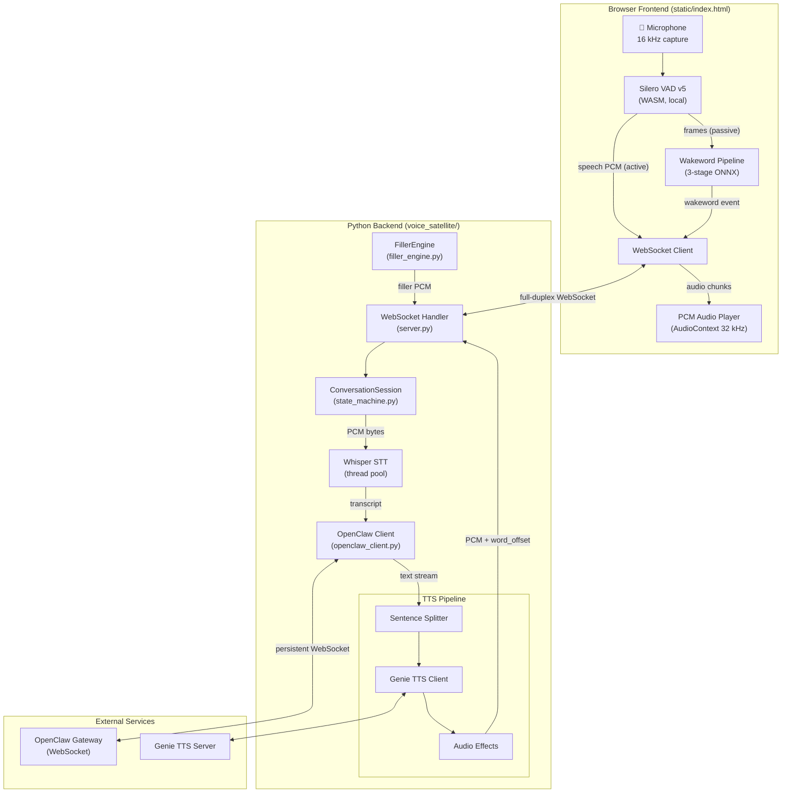
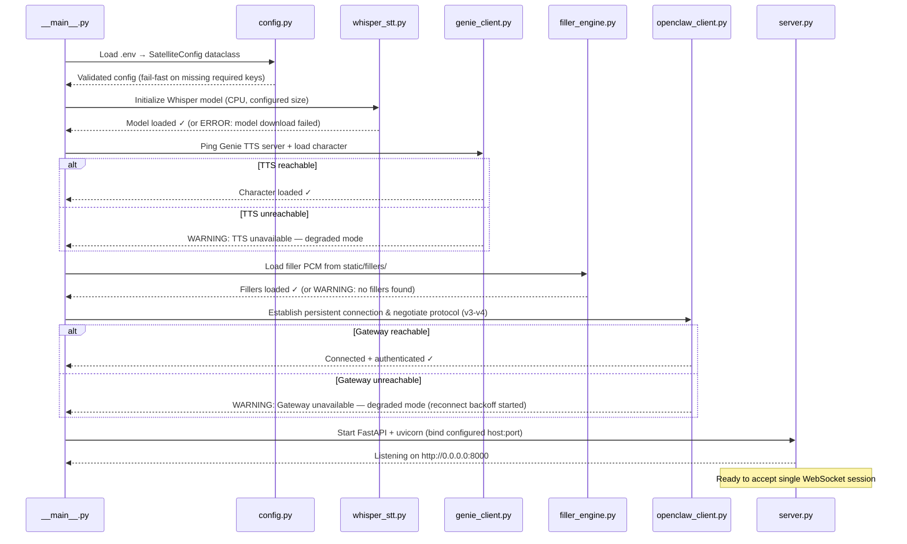
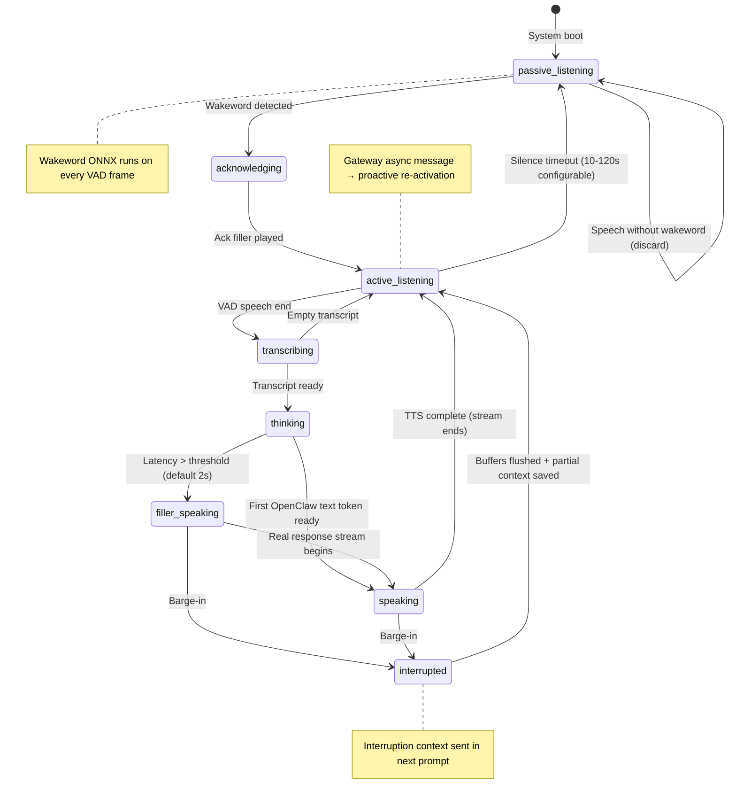

# Implementation Plan: Voice Satellite Core Client
**Branch**: `001-voice-satellite-core` | **Date**: 2026-05-19 | **Spec**: [spec.md](file:///home/aiden/Projects/voice-satellite/specs/001-voice-satellite-core/spec.md)
**Input**: Feature specification from `specs/001-voice-satellite-core/spec.md`
## Summary
Build a modular, hardware-agnostic voice satellite client for the OpenClaw
multi-agent framework. The system implements a browser-based frontend
(VAD + wakeword ONNX) communicating over full-duplex WebSocket to a Python
backend (STT + LLM routing + TTS streaming). The architecture is decomposed
into five independent layers: **Audio I/O**, **Wakeword Engine**,
**Network/Protocol**, **TTS Engine**, and **Orchestration**. A startup
bootstrap sequence verifies hardware compatibility and service connectivity
before entering the main event loop.
## Technical Context
**Language/Version**: Python 3.11+ (backend), JavaScript ES2022 (frontend)
**Primary Dependencies**:
- Backend: FastAPI, uvicorn, websockets, faster-whisper, aiohttp, python-dotenv, numpy, scipy
- Frontend: onnxruntime-web (WASM), @ricky0123/vad-web (Silero VAD v5), Web Audio API
**Storage**: Filesystem only (PCM filler audio, ONNX models, config files). No database.
**Testing**: Python unittest (no pytest — aligns with legacy pattern), browser manual testing
**Target Platform**: Linux (x86_64, aarch64), modern browser (Chrome/Firefox/Edge 90+ with WASM SIMD)
**Project Type**: Web service (FastAPI backend) + single-page browser frontend
**Performance Goals**:
- Wakeword-to-acknowledgement: <500 ms (SC-002)
- Speech-end-to-first-audio: <3 s local (SC-003)
- Barge-in stop latency: <200 ms client-side (SC-004)
- Filler playback start: <50 ms from threshold (SC-006)
**Constraints**:
- CPU-only inference (no GPU dependency)
- Single active WebSocket session at a time
- Dual-rate audio: 16 kHz capture, 32 kHz TTS playback
- All config via `.env` — zero hardcoded paths/credentials
**Scale/Scope**: Single-user ambient device, 1 concurrent session, 24+ hour continuous operation
## Constitution Check
| # | Principle | Status | Evidence |
|---|-----------|--------|----------|
| I | Hardware Agnosticism | ✅ PASS | No hardcoded device paths. Audio device via config. Same codebase x86_64/aarch64. Adaptive wakeword threading for Pi. |
| II | Configuration-Driven | ✅ PASS | All service URLs, model paths, API keys, thresholds loaded from `.env`. `.env.example` template maintained. Fail-fast on missing required values. |
| III | Modular Architecture | ✅ PASS | Five independent layers with clear interfaces. Each module independently importable/testable. Swap STT/TTS without cross-module changes. |
| IV | Async-First I/O | ✅ PASS | asyncio event loop throughout. CPU-bound STT offloaded to thread pool. Streaming TTS pipeline — no full-payload buffering. Structured task cancellation. |
| V | Documentation Discipline | ✅ PASS | All public modules carry docstrings. quickstart.md for 10-min setup. Architecture in plan.md. Inline comments explain *why*. |
| VI | Resilient Error Handling | ✅ PASS | Exponential backoff with 60s cap, unlimited retries. Degraded-mode operation. UI status indicators — never spoken stack traces. Graceful filler engine degradation. |
**Gate result: PASS** — no violations. Proceeding to Phase 0.
## Project Structure
specs/001-voice-satellite-core/
├── plan.md              # This file
├── research.md          # Phase 0 output
├── data-model.md        # Phase 1 output
├── quickstart.md        # Phase 1 output
├── contracts/           # Phase 1 output (WebSocket protocol)
└── tasks.md             # Phase 2 output (/speckit-tasks)
```
### Source Code (repository root)
```text
voice_satellite/
├── __init__.py
├── __main__.py              # CLI entry point (uvicorn launcher)
├── config.py                # Centralised config loader (.env → dataclass)
├── server.py                # FastAPI app + WebSocket endpoint
│
├── audio/                   # Audio I/O Module
│   ├── __init__.py
│   ├── constants.py         # Sample rates, PCM format constants
│   ├── filler_engine.py     # Pre-rendered PCM filler loader
│   └── effects.py           # Audio post-processing (glitch FX)
│
├── wakeword/                # Wakeword Engine (frontend, served as static)
│   └── README.md            # Documents ONNX model placement
│
├── stt/                     # Speech-to-Text Module
│   ├── __init__.py
│   └── whisper_stt.py       # faster-whisper wrapper (thread-pool)
│
├── tts/                     # TTS Engine Module
│   ├── __init__.py
│   ├── genie_client.py      # Genie TTS HTTP client
│   └── sentence_splitter.py # Sentence + markup-tag splitter
│
├── gateway/                 # Network/Protocol Layer
│   ├── __init__.py
│   ├── openclaw_client.py   # OpenClaw WebSocket client (protocol v3+)
│   └── auth.py              # Ed25519 device identity + challenge-response
│
├── session/                 # Orchestration Layer
│   ├── __init__.py
│   └── state_machine.py     # ConversationSession state machine
static/
├── index.html               # Single-page frontend (VAD + wakeword + UI)
├── libs/                    # Vendored WASM: ort.js, vad.bundle, silero ONNX
├── wakeword/                # User-provided ONNX wakeword models
└── fillers/                 # Pre-rendered PCM filler audio by category
    ├── thinking/
    ├── working/
    ├── acknowledge/
    ├── slow_task/
    └── signoff/
scripts/
├── generate_fillers.py      # Batch-render filler phrases via Genie TTS
└── download_wakeword_models.sh  # Download OpenWakeWord ONNX pipeline
tests/
├── contract/
├── integration/
└── unit/
├── test_config.py
├── test_session.py
├── test_filler_engine.py
├── test_genie_client.py
├── test_openclaw_client.py
├── test_whisper_stt.py
├── test_sentence_splitter.py
└── test_effects.py
```
**Structure Decision**: Hybrid web-service layout. The Python backend follows a
domain-driven module structure under `voice_satellite/` where each module maps to
a spec entity. The frontend is a single HTML file served from `static/` with
vendored WASM dependencies (no build step required). This matches the legacy
architecture while adding clear module boundaries required by Constitution
Principle III.
---

---
## Bootstrap Sequence
The satellite follows a deterministic startup sequence that validates
configuration and hardware before entering the main event loop:

### Startup Health Report
After bootstrap, the server logs a health report:
```
╔══════════════════════════════════════════════════╗
║  Voice Satellite — Startup Health Report         ║
╠══════════════════════════════════════════════════╣
║  Config:     .env loaded ✓                       ║
║  STT:        tiny.en (CPU) ✓                     ║
║  TTS:        default @ http://127.0.0.1:8000 ✓   ║
║  Gateway:    ws://127.0.0.1:18789 (v3) ✓         ║
║  Fillers:    14 loaded (5 categories) ✓          ║
║  Wakeword:   model.onnx (Hey Assistant) [frontend] ║
║  Listening:  http://0.0.0.0:8000                 ║
╚══════════════════════════════════════════════════╝
```
---
## Module Interfaces
### 1. Config Module (`voice_satellite/config.py`)
Single source of truth. Loads `.env` via `python-dotenv`, validates required
fields, and exposes a frozen dataclass consumed by all other modules.
```python
@dataclass(frozen=True)
class SatelliteConfig:
    # OpenClaw Gateway
    gateway_url: str               # default: http://127.0.0.1:18789
    gateway_token: str             # REQUIRED — fail fast
    gateway_min_protocol: int      # default: 3
    gateway_max_protocol: int      # default: 4
    gateway_agent_id: str          # default: main  (OPENCLAW_AGENT_ID)
    # Genie TTS
    tts_url: str                   # default: http://127.0.0.1:8000
    tts_character_name: str        # default: default
    tts_onnx_model_dir: str        # REQUIRED for TTS
    tts_reference_audio: str       # REQUIRED for TTS
    tts_reference_text: str        # REQUIRED for TTS
    tts_language: str              # default: en
    # Whisper STT
    whisper_model: str             # default: tiny.en
    whisper_language: str          # default: en
    # Audio / Filler
    filler_dir: Path               # default: static/fillers
    filler_threshold_secs: float   # default: 2.0
    # Server
    host: str                      # default: 0.0.0.0
    port: int                      # default: 8000
    # Feature flags
    skip_genie_init: bool          # default: False
```
### 2. Audio I/O Module (`voice_satellite/audio/`)
**`constants.py`**: Canonical sample rate constants used across modules.
```python
CAPTURE_SAMPLE_RATE = 16_000   # VAD / STT boundary
TTS_SAMPLE_RATE = 32_000       # TTS / playback boundary
PCM_SAMPLE_WIDTH = 2           # 16-bit signed LE mono
```
**`filler_engine.py`**: Loads pre-rendered PCM from `filler_dir` at startup.
Returns random filler by category from RAM. Falls back to `thinking` category.
**`effects.py`**: Optional audio post-processing chain (pitch shift, tremolo,
overdrive, bitcrush, stutter). Applied to tagged PCM segments via numpy.
Effects are registered per-character and only activated when the TTS response
contains `<glitch>` tags.
### 3. Wakeword Engine (`static/wakeword/` + frontend JS)
Three-stage ONNX pipeline running entirely in the browser via
`onnxruntime-web` WASM:
1. **Melspectrogram** (`melspectrogram.onnx`) — 1280 samples → mel frames
2. **Embedding** (`embedding_model.onnx`) — 76 mel frames → 96-dim embedding
3. **Classifier** (`model.onnx`) — 16 embeddings → wakeword score
**Adaptive threading**: On startup, the pipeline benchmarks 10 inference
passes. If average latency exceeds 30 ms/frame, it offloads to a dedicated
Web Worker with frame-dropping to keep VAD responsive.
**Configuration**: `static/wakeword/model.json` declares model filename,
wakeword name, sample rate, and threshold. Users swap the entire
`static/wakeword/` directory to change wakewords.
### 4. Network/Protocol Layer (`voice_satellite/gateway/`)
**`openclaw_client.py`**: Async WebSocket client for the OpenClaw gateway.
- Negotiates protocol version via configurable min/max range
- Challenge-response authentication (Ed25519 device identity)
- Supports one-shot and persistent agent sessions
- Streaming text extraction from agent responses
**`auth.py`**: Ed25519 key pair management. Auto-generates device identity
on first run if no key exists. Signs gateway challenges.
**Reconnection policy**: Exponential backoff starting at 1 s, capped at 60 s,
unlimited retries. Enters degraded-mode state (wakeword/VAD continue, agent
responses unavailable). Resumes automatically on reconnection.
### 5. TTS Engine (`voice_satellite/tts/`)
**`genie_client.py`**: Async HTTP client for the Genie TTS server.
- Loads character (ONNX model + reference audio) at startup
- Streams PCM audio chunks per-sentence
- Input sanitization: skip non-alphanumeric, ensure trailing punctuation
- Cancellable: responds to asyncio cancellation for barge-in
**`sentence_splitter.py`**: Splits text at sentence boundaries (`.!?`) and
custom markup tags (`<glitch>...</glitch>`). Ensures tagged segments are
synthesized independently for per-segment effect processing.
### 6. Orchestration Layer (`voice_satellite/session/`)
**`state_machine.py`**: Per-connection `ConversationSession` with 8 states:
```
passive_listening → acknowledging → active_listening → transcribing
    → thinking → filler_speaking → speaking → interrupted
```
Manages: generation task lifecycle, silence timer, barge-in word offset
tracking, partial response context injection (≥10-word threshold).
On barge-in, sends `sessions.abort` via the persistent OpenClaw client
before clearing the in-flight TTS pipeline.
### 7. Session Enforcement
The WebSocket endpoint enforces single-session policy (FR-007a). A module-level
lock tracks the active connection. Additional clients receive a JSON error
message and immediate close:
```json
{"type": "error", "message": "Session already active. Please wait."}
```
---
## Conversation State Machine

---
## Post-Design Constitution Re-Check
| # | Principle | Status | Evidence |
|---|-----------|--------|----------|
| I | Hardware Agnosticism | ✅ PASS | Config-driven device selection. Adaptive wakeword threading. Same structure x86/ARM. |
| II | Configuration-Driven | ✅ PASS | `SatelliteConfig` dataclass from `.env`. `.env.example` with all variables. Fail-fast validation. |
| III | Modular Architecture | ✅ PASS | 7 independent modules under `voice_satellite/`. Each independently testable. Cross-module via typed interfaces. |
| IV | Async-First I/O | ✅ PASS | asyncio throughout. Whisper in thread pool. Streaming TTS. Structured task cancellation via ConversationSession. |
| V | Documentation Discipline | ✅ PASS | quickstart.md, plan.md, docstrings required. Inline comments explain *why*. |
| VI | Resilient Error Handling | ✅ PASS | Degraded mode for TTS/Gateway. Exponential backoff (60s cap, unlimited). UI indicators, never spoken errors. |
**Gate result: PASS** — no violations detected post-design.
## Complexity Tracking
