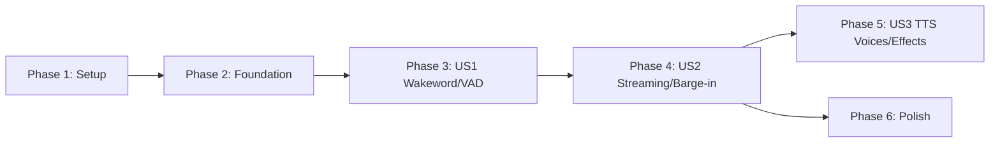

# Tasks: Voice Satellite Core Client
**Input**: Design documents from `specs/001-voice-satellite-core/`
**Prerequisites**: plan.md (required), spec.md (required), research.md, data-model.md, contracts/
**Tests**: Not explicitly requested — test tasks omitted.
**Organization**: Tasks are grouped by user story to enable independent implementation and testing of each story.
## Format: `[ID] [P?] [Story] Description`
- **[P]**: Can run in parallel (different files, no dependencies)
- **[Story]**: Which user story this task belongs to (e.g., US1, US2, US3)
- Include exact file paths in descriptions
## Path Conventions
- **Backend**: `voice_satellite/` at repository root
- **Frontend**: `static/` at repository root
- **Config**: `.env.example` at repository root
- Paths are relative to `/home/aiden/Projects/voice-satellite/`
---
## Phase 1: Setup (Shared Infrastructure)
**Purpose**: Project initialization, package scaffolding, and configuration baseline
- [x] T001 Create project directory structure with all `__init__.py` files per plan layout: `voice_satellite/`, `voice_satellite/audio/`, `voice_satellite/stt/`, `voice_satellite/tts/`, `voice_satellite/gateway/`, `voice_satellite/session/`, `voice_satellite/llm/`, `static/`, `static/libs/`, `static/wakeword/`, `static/fillers/`, `scripts/`, `tests/`
- [x] T002 [P] Create `requirements.txt` with all Python dependencies: fastapi, uvicorn, websockets, openai, python-dotenv, faster-whisper, numpy, scipy, aiohttp
- [x] T003 [P] Create `.env.example` with all configuration variables documented (LLM, Gateway, TTS, STT, Filler, Server, Feature flags) per plan §Config Module and data-model.md §SatelliteConfig
- [x] T004 [P] Create `.gitignore` excluding `.env`, `__pycache__/`, `*.pyc`, `venv/`, `.venv/`, `*.onnx` (user-provided models), and `static/fillers/**/*.pcm` (generated audio)
---
## Phase 2: Foundational (Blocking Prerequisites)
**Purpose**: Core infrastructure that MUST be complete before ANY user story can be implemented
**⚠️ CRITICAL**: No user story work can begin until this phase is complete
- [x] T005 Implement `voice_satellite/audio/constants.py` defining `CAPTURE_SAMPLE_RATE = 16_000`, `TTS_SAMPLE_RATE = 32_000`, `PCM_SAMPLE_WIDTH = 2` as the canonical audio rate boundary constants referenced by all modules
- [x] T006 Implement `voice_satellite/config.py` with frozen `SatelliteConfig` dataclass, `.env` loading via `python-dotenv`, fail-fast validation for required keys (`LITELLM_API_KEY`, `OPENCLAW_GATEWAY_TOKEN`), warn-and-degrade for optional TTS keys, and all defaults per plan §Config Module
- [x] T007 Implement `voice_satellite/__main__.py` as the CLI entry point that loads config, runs the bootstrap sequence (STT init → TTS ping → filler load → gateway test), prints the startup health report, and launches uvicorn with configured host/port
- [x] T008 Implement `voice_satellite/server.py` with FastAPI app creation, static file mounting (`static/`), single-session WebSocket endpoint skeleton (`/ws`) with `asyncio.Lock`-based enforcement (FR-007a), and JSON error response for rejected connections
**Checkpoint**: Foundation ready — config loads, server starts, single WebSocket connection accepted, static files served
---
## Phase 3: User Story 1 — Wakeword Activation & VAD (Priority: P1) 🎯 MVP
**Goal**: User says the wakeword, system acknowledges and transitions to active listening. VAD captures speech and forwards PCM to the backend. Silence timeout returns to passive mode.
**Independent Test**: Boot the satellite, open browser, say the wakeword, speak a phrase — verify state transitions (passive → acknowledging → active_listening → transcribing) appear in the UI. No TTS or gateway needed.
### Implementation for User Story 1
- [x] T009 [P] [US1] Copy vendored WASM assets to `static/libs/`: `ort.js`, `ort-wasm-simd.wasm`, `ort-wasm-simd-threaded.wasm`, `ort-wasm-threaded.js`, `ort-wasm-threaded.wasm`, `ort-wasm-threaded.worker.js`, `vad.bundle.min.js`, `vad.worklet.bundle.min.js`, `silero_vad_v5.onnx` from `old_project/static/libs/`
- [x] T010 [P] [US1] Copy wakeword ONNX models to `static/wakeword/`: `melspectrogram.onnx`, `embedding_model.onnx`, `model.onnx`, `model.json` from `old_project/static/wakeword/`
- [x] T011 [US1] Implement `voice_satellite/session/state_machine.py` with `SessionState` enum (8 states per plan §State Machine), `ConversationSession` class with state property, `transition()` method enforcing valid transitions only, silence timer management (`start_silence_timer`, `reset_silence_timer`), and state change callback hook for WebSocket notifications
- [x] T012 [US1] Implement the wakeword and VAD frontend in `static/index.html`: initialise `MicVAD` from `@ricky0123/vad-web` with local WASM paths (`onnxWASMBasePath`), load wakeword ONNX models (`melspectrogram.onnx`, `embedding_model.onnx`, `model.onnx`) from `model.json`, implement three-stage `_runWakewordPipeline()` (mel → embedding → classifier) with sliding window and configurable threshold, implement adaptive threading benchmark (10 passes, >30ms → offload to Web Worker), send `{"type": "wakeword"}` on detection, send binary PCM on speech end, display connection status and current state from server status messages
- [x] T013 [US1] Wire wakeword/VAD WebSocket handling in `voice_satellite/server.py`: on `{"type": "wakeword"}` message transition session to `acknowledging`, send status update, on binary PCM message (when in `active_listening`) store audio buffer, on `{"type": "set_timeout"}` update session silence timeout within [10, 120] range
- [x] T014 [US1] Implement silence timeout logic in `voice_satellite/server.py`: when session enters `active_listening`, start a configurable silence timer (default 30s) that transitions back to `passive_listening` on expiry, reset timer on any incoming speech PCM
**Checkpoint**: Wakeword detection works end-to-end in the browser. VAD captures speech. State transitions display in the UI. No backend processing yet (transcription/responses).
---
## Phase 4: User Story 2 — Streaming Audio & Interruptible Conversations (Priority: P1)
**Goal**: Captured audio is transcribed, routed through LLM, response streamed via TTS with barge-in support. Filler audio plays during latency. Background tasks tracked.
**Independent Test**: Say wakeword, ask a question, receive spoken response. Interrupt mid-response and verify audio stops, new response reflects awareness of partial answer.
**Dependencies**: Requires Phase 3 (US1) — wakeword/VAD must be functional for audio capture.
### Implementation for User Story 2
- [x] T015 [P] [US2] Implement `voice_satellite/stt/whisper_stt.py` with `WhisperSTT` class: initialise `faster-whisper` model with configured size/language, expose `async def transcribe(pcm_bytes) -> str` that runs inference in `asyncio.get_event_loop().run_in_executor(thread_pool)` to avoid blocking the event loop, use an `asyncio.Lock` to serialise concurrent transcription requests
- [x] T016 [P] [US2] Implement `voice_satellite/tts/sentence_splitter.py` with `split_sentences(text) -> list[SentenceChunk]`: regex split on `(?<=[.!?])\s+`, extract `<glitch>...</glitch>` spans as separate tagged chunks, filter empty/non-alphanumeric chunks, ensure trailing punctuation on each chunk, return list of `SentenceChunk(text, tagged)` named tuples
- [x] T017 [P] [US2] Implement `voice_satellite/tts/genie_client.py` with `GenieTTSClient` class: async HTTP client using `aiohttp.ClientSession`, `load_character()` to register ONNX model + reference audio with the Genie TTS server, `synthesize(text) -> AsyncIterator[bytes]` streaming PCM chunks per-sentence, input sanitisation (skip non-alphanumeric, ensure trailing punctuation, handle casing), graceful degradation (warn + return empty on server unreachable), respond to `asyncio.CancelledError` for barge-in cleanup
- [x] T018 [P] [US2] Implement `voice_satellite/audio/filler_engine.py` with `FillerEngine` class: load all `.pcm` files from configured `filler_dir` into RAM at startup organised by subdirectory category (thinking, working, acknowledge, slow_task, signoff), expose `get_filler(category) -> bytes | None` returning random PCM from category (fallback to `thinking`), expose `get_categories() -> dict[str, int]` for health report, handle missing filler directory gracefully (warn, return None)
- [x] T019 [P] [US2] Implement `voice_satellite/gateway/auth.py` with Ed25519 device identity management: `load_or_generate_keypair(path) -> (private_key, public_key)` auto-generating on first run if file missing, `sign_challenge(private_key, nonce) -> signature` for gateway handshake, key serialisation to/from PEM files
- [x] T020 [P] [US2] Implement `voice_satellite/gateway/openclaw_client.py` with `OpenClawClient` class: async WebSocket client using `websockets` library, `connect()` with configurable min/max protocol version negotiation, challenge-response auth flow (send connect → receive challenge → sign nonce → send response → receive connected), `send_message(agent_id, message, mode, session_key)` for one-shot and persistent interactions, `stream_response() -> AsyncIterator[str]` extracting text tokens from agent stream, exponential backoff reconnection (1s initial, 60s cap, unlimited retries), degraded-mode flag property
- [x] T021 [P] [US2] Implement `voice_satellite/session/task_tracker.py` with `TaskTracker` class: `start_task(agent_id, description, coro) -> task_id wrapping coroutine in asyncio.Task, check_tasks() -> list[TrackedTask]` returning status of all tracked tasks, `get_completed() -> list[TrackedTask]` popping completed tasks since last check, completion callback registration for proactive session reactivation, proper task cleanup on cancellation
- [x] T022 [P] [US2] Implement `voice_satellite/llm/router.py` with `LLMRouter` class: async OpenAI client via `openai.AsyncOpenAI` pointing to LiteLLM proxy, `route(transcript, history, task_summaries) -> CoordinatorDecision` using system prompt with coordinator instructions, conversation history management (append user/assistant turns, max history window), parse structured JSON response into `CoordinatorDecision` (action, message, reason, openclaw), handle `conversation_end` action for sign-off flow
- [x] T023 [US2] Implement the main voice pipeline in `voice_satellite/server.py`: wire the full async pipeline in the WebSocket handler — on speech PCM received: transition to `transcribing` → call `WhisperSTT.transcribe()` → transition to `thinking` → call `LLMRouter.route()` → based on action: `answer` → stream through TTS, `openclaw` → dispatch to gateway via `TaskTracker`, `check_tasks` → report task status, `conversation_end` → play signoff filler → return to passive
- [x] T024 [US2] Implement TTS streaming with word offset tracking in `voice_satellite/server.py`: split response via `SentenceSplitter`, synthesise each chunk via `GenieTTSClient`, track cumulative word count per chunk, send each audio chunk as `{"type": "audio", "data": base64_pcm, "word_offset": N, "sample_rate": 32000}`, send `{"type": "audio_end"}` when complete, send `{"type": "assistant_response", "text": full_text}` for transcript display
- [x] T025 [US2] Implement filler audio race in `voice_satellite/server.py`: after LLM routing returns `answer` action, use `asyncio.wait` with `filler_threshold_secs` timeout on the first TTS chunk — if timeout fires first, send a random `thinking` filler from `FillerEngine` as audio chunk, cancel filler playback when real TTS audio arrives, transition through `filler_speaking → speaking`
- [x] T026 [US2] Implement barge-in handling in `static/index.html` and `voice_satellite/server.py`: frontend — track `wordsPlayedAtTime` map (audioStartTime → wordOffset) for each audio chunk, on VAD speech detection during playback: compute `getWordsPlayedNow()` from current AudioContext time, send `{"type": "playback_progress", "words_played": N}` then `{"type": "interrupt"}`, stop all queued audio; backend — on interrupt: cancel generation task, reconstruct partial text `words[:words_played]`, inject as partial assistant turn in LLM history, transition to `active_listening`
- [x] T027 [US2] Implement background task completion notification in `voice_satellite/server.py`: register `TaskTracker` completion callback that checks if session is `passive_listening`, if so proactively transition to `acknowledging` → play acknowledge filler → speak task summary via TTS → return to `passive_listening`
**Checkpoint**: Full conversation loop works — wakeword → speak → response → barge-in. Filler plays during latency. OpenClaw agent tasks dispatched and tracked. Background task results spoken proactively.
---
## Phase 5: User Story 3 — TTS with Configurable ONNX Voices (Priority: P2)
**Goal**: Administrator configures a custom TTS voice character. Audio post-processing effects (glitch distortion) are applied to tagged segments in real-time.
**Independent Test**: Configure a custom voice in `.env`, start the satellite, trigger a response — verify audio plays in the configured voice. Add `<glitch>` tags to a response — verify distortion effect is audible.
**Dependencies**: Requires Phase 4 (US2) — TTS streaming pipeline must be functional.
### Implementation for User Story 3
- [x] T028 [P] [US3] Implement `voice_satellite/audio/effects.py` with audio post-processing functions: `apply_pitch_shift(pcm, semitones)`, `apply_tremolo(pcm, rate, depth)`, `apply_overdrive(pcm, gain)`, `apply_bitcrush(pcm, bit_depth)`, `apply_stutter(pcm, chunk_ms, repeats)` — all operating on numpy int16 arrays at `TTS_SAMPLE_RATE`, plus `apply_effect_chain(pcm, effects_config) -> bytes` composing multiple effects from a config dict
- [x] T029 [US3] Integrate audio effects into the TTS streaming pipeline in `voice_satellite/server.py`: after `GenieTTSClient` returns a PCM chunk for a tagged sentence (where `SentenceChunk.tagged == True`), apply the configured character's effect chain via `apply_effect_chain()` before encoding and sending to the client
- [x] T030 [US3] Implement TTS character initialisation in `voice_satellite/__main__.py` bootstrap: on startup if `skip_genie_init` is False, call `GenieTTSClient.load_character()` with configured ONNX model dir, reference audio, and reference text — log success or warn on failure and set degraded TTS mode flag
- [x] T031 [US3] Implement TTS degraded mode handling in `voice_satellite/server.py`: when TTS is unavailable (server unreachable or character load failed), skip audio synthesis entirely, send `{"type": "assistant_response", "text": response_text}` as text-only fallback, retry TTS character load on the first synthesis request after failure
**Checkpoint**: Custom voice character plays correctly. Glitch effects audible on tagged segments. Degraded mode falls back gracefully to text-only.
---
## Phase 6: Polish & Cross-Cutting Concerns
**Purpose**: Documentation, startup reporting, and production readiness
- [x] T032 [P] Create `README.md` at repository root with project overview, architecture diagram reference, link to `specs/001-voice-satellite-core/quickstart.md`, and contribution guidelines referencing constitution.md
- [x] T033 [P] Create `scripts/generate_fillers.py` that batch-renders filler phrases via the Genie TTS server: define phrase lists per category (thinking, working, acknowledge, slow_task, signoff), call `GenieTTSClient.synthesize()` for each, write raw PCM to `static/fillers/<category>/<slug>.pcm`
- [x] T034 [P] Create `scripts/download_wakeword_models.sh` that downloads the OpenWakeWord ONNX pipeline (melspectrogram.onnx, embedding_model.onnx) from the official release and places them in `static/wakeword/`
- [x] T035 Implement the startup health report in `voice_satellite/__main__.py`: after all bootstrap checks complete, print the formatted health report box showing config status, STT model, TTS character + URL, gateway URL + negotiated protocol, filler count by category, wakeword model name, and listen address
- [ ] T036 Add structured logging throughout all modules using Python `logging` with `%(name)s` namespace per module (e.g., `voice_satellite.stt`, `voice_satellite.gateway`), ensure no sensitive values (API keys, tokens) appear in logs, log state transitions at INFO level and errors at ERROR level
---
## Dependencies & Execution Order
### Phase Dependencies
- **Setup (Phase 1)**: No dependencies — can start immediately
- **Foundational (Phase 2)**: Depends on Setup (Phase 1) completion — BLOCKS all user stories
- **US1 (Phase 3)**: Depends on Foundational (Phase 2) — no other story dependencies
- **US2 (Phase 4)**: Depends on US1 (Phase 3) — needs wakeword/VAD for audio capture
- **US3 (Phase 5)**: Depends on US2 (Phase 4) — needs TTS streaming pipeline for voice rendering
- **Polish (Phase 6)**: Can start after Phase 4 (US2); does not depend on US3
### User Story Dependencies

- **US1 → US2**: US2 requires active mode audio capture from US1
- **US2 → US3**: US3 adds configurable voices and effects to the TTS pipeline built in US2
- **US2 → Polish**: Polish can proceed once the core conversation loop is functional
### Within Each User Story
- Models/constants before services
- Services before server integration
- Server integration before frontend wiring
- Core implementation before cross-cutting (logging, error handling)
### Parallel Opportunities
**Phase 1** — all 4 tasks are parallel (different files):
- T001, T002, T003, T004
**Phase 2** — T005 is parallel with nothing; T006, T007, T008 are sequential (each depends on prior):
- T005 can run alongside T006
**Phase 3 (US1)** — T009 and T010 are parallel (copy assets); T011 is parallel (different module); T012-T014 are sequential:
- T009, T010, T011 in parallel → T012 → T013 → T014
**Phase 4 (US2)** — 8 modules are parallel (T015–T022); then 5 integration tasks are sequential (T023–T027):
- T015, T016, T017, T018, T019, T020, T021, T022 all in parallel → T023 → T024 → T025 → T026 → T027
**Phase 5 (US3)** — T028 is parallel; T029–T031 are sequential:
- T028 → T029 → T030 → T031
**Phase 6** — T032, T033, T034 are parallel; T035 and T036 are parallel:
- T032, T033, T034 in parallel → T035, T036 in parallel
---
## Parallel Example: User Story 2 (Maximum Parallelism)
```bash
# Launch all independent modules for US2 together:
Task T015: "Implement WhisperSTT in voice_satellite/stt/whisper_stt.py"
Task T016: "Implement SentenceSplitter in voice_satellite/tts/sentence_splitter.py"
Task T017: "Implement GenieTTSClient in voice_satellite/tts/genie_client.py"
Task T018: "Implement FillerEngine in voice_satellite/audio/filler_engine.py"
Task T019: "Implement Ed25519 auth in voice_satellite/gateway/auth.py"
Task T020: "Implement OpenClawClient in voice_satellite/gateway/openclaw_client.py"
Task T021: "Implement TaskTracker in voice_satellite/session/task_tracker.py"
Task T022: "Implement LLMRouter in voice_satellite/llm/router.py"
# Then wire them together sequentially:
Task T023: "Wire main voice pipeline in server.py"
Task T024: "Wire TTS streaming with word offsets"
Task T025: "Wire filler audio race"
Task T026: "Wire barge-in handling"
Task T027: "Wire background task notifications"
```
---
## Implementation Strategy
### MVP First (User Story 1 Only)
1. Complete Phase 1: Setup (T001–T004)
2. Complete Phase 2: Foundational (T005–T008)
3. Complete Phase 3: User Story 1 (T009–T014)
4. **STOP and VALIDATE**: Wakeword detection + VAD + state transitions work in browser
5. Deploy/demo if ready — proves the audio capture pipeline works on target hardware
### Incremental Delivery
1. Setup + Foundational → Foundation ready ✓
2. Add US1 → Wakeword/VAD functional → Test independently ✓
3. Add US2 → Full conversation loop → Test independently → **Demo (Core MVP!)** ✓
4. Add US3 → Custom voices + effects → Test independently → **Demo (Full Feature)** ✓
5. Polish → Documentation, scripts, logging → **Release Ready** ✓
### Solo Developer Strategy
Execute sequentially: Phase 1 → 2 → 3 → 4 → 5 → 6
Within Phase 4, maximise parallelism by writing all 8 independent modules
(T015–T022) before wiring them into `server.py` (T023–T027). This avoids
context-switching and ensures each module is self-contained.
---
## Notes
- [P] tasks = different files, no dependencies on incomplete tasks
- [Story] label maps task to specific user story for traceability
- All tasks build from scratch in the project root — no old_project refactoring
- The old_project is referenced only for asset copying (T009, T010) and as architectural reference
- Commit after each task or logical group
- Stop at any checkpoint to validate the story independently